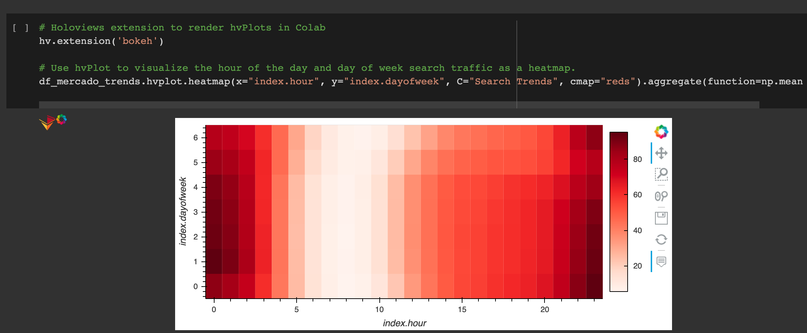

# FB Prophet Forecasting

This notebook utilizes Google Colab and FB Prophet to analyze and predict revenue statistics for e-commerce site MercadoLibre

---

## Technologies

This project leverages Python 3.7 with the following packages:

* [Pandas](https://pandas.pydata.org/docs/) - Data analysis and manipulation tool

* [NumPy](https://numpy.org/doc/stable/) - Fundamental package for scientific computing in Python

* [hvPlot](https://hvplot.holoviz.org/https://hvplot.holoviz.org/) - A familiar and high-level API for data exploration and visualization

* [Prophet](https://facebook.github.io/prophet/) - Prophet is a procedure for forecasting time series data based on an additive model where non-linear trends are fit with yearly, weekly, and daily seasonality, plus holiday effects

* [HoloViews](https://holoviews.org/install.html) - HoloViews is an open-source Python library designed to make data analysis and visualization seamless and simple

---

## Installation Guide

Before running the application, first install the following dependencies.

```python
  pip install pandas
  pip install numpy
  pip install hvplot
  pip install holoviews
  pip install prophet
```

---

## Examples

Upon running the notebook, you will see several graphics assisting in your analysis



---

## Usage

To use the forecasting net prophet notebook, open forecasting_net_prophet.ipynb in a Jupyter Lab environment (or other IDE with Jupyter notebook extensions):

---

## Contributors

Pull requests are welcome. For major changes, please open an issue first to discuss what you would like to change.

Please make sure to update tests as appropriate.

---

## License

N/A
